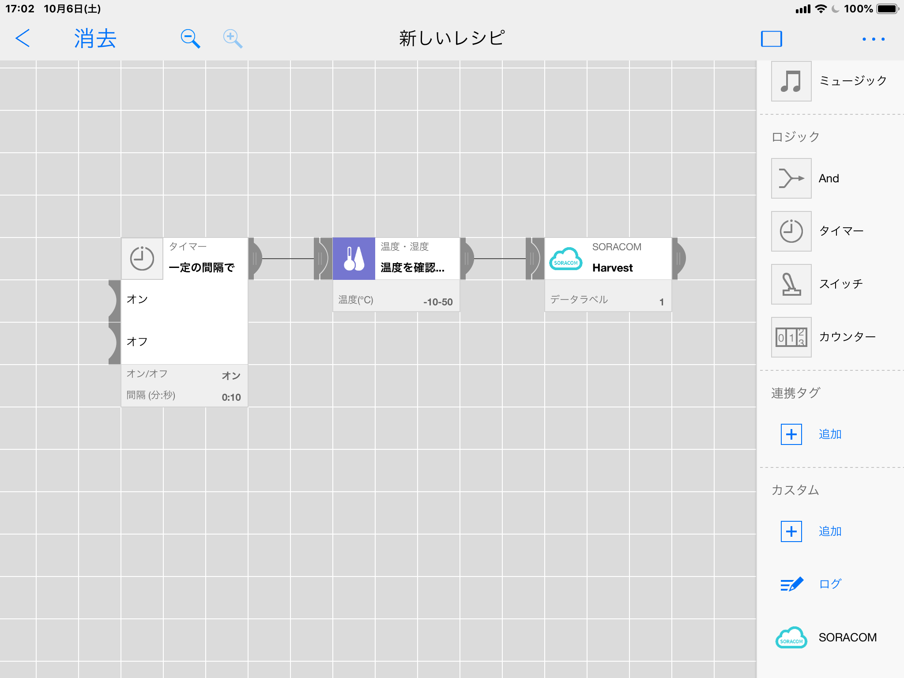

# soracom-tag
MESH Custom Tag for SORACOM Services

# Install
- Open MESH Project SDK page : https://meshprj.com/sdk/mypage/
(if you don't have MESH account, create from here https://meshprj.com/signin/ )
- Click "Create New Tag" link
- Click "Import"
- Copy & Paste JSON text from [soracom_tag.json](soracom_tag.json) file and click "Load JSON"
- Click "Save"

# How to use
- Connect your iPhone/iPad with SORACOM Air SIM
- Enable Harvest in SIM Group
- In MESH App, click "Add" in custom tag (bottom)
- Click "SORACOM" and click "Add"
- Drag & Drop "SORACOM" Icon and connect sensor to the tag

- Check Harvest page

# How to build
- change codes under functions directory
- execute `ruby build.rb > soracom_tag.json` (you need Ruby 2.5+)
